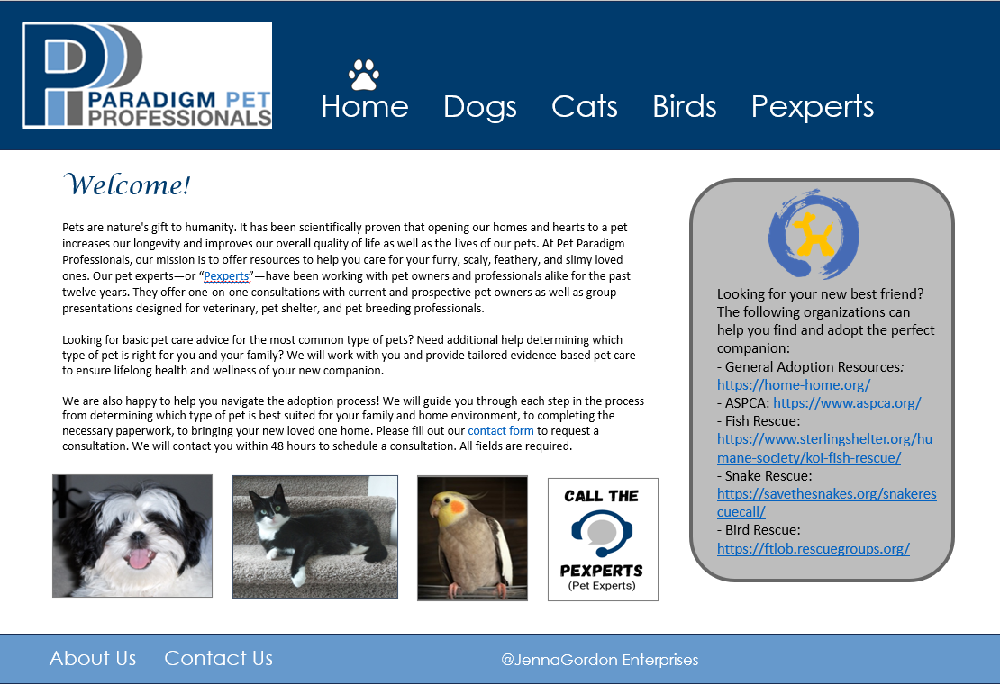
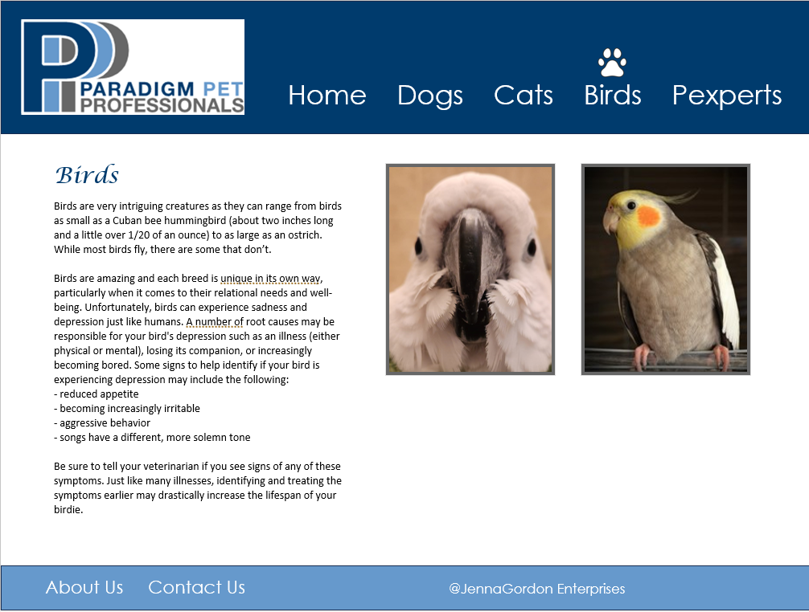
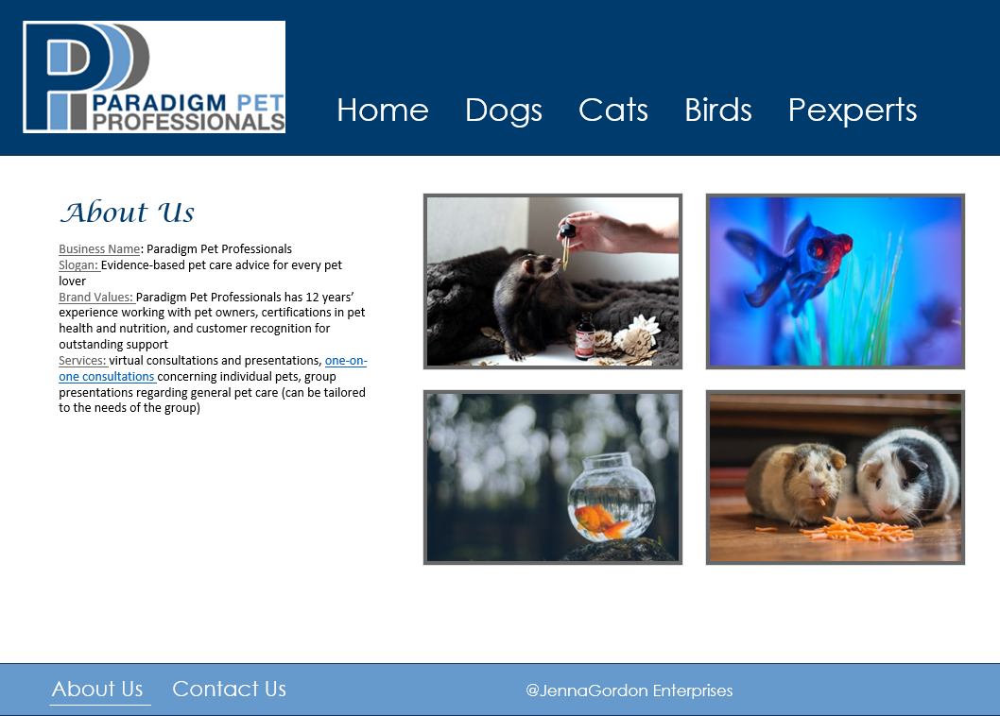

# Pet Paradigm UI Prototype

This project showcases a website interface prototype created in Microsoft PowerPoint for the WGU D279 User Interface Design course.

## 📌 Overview
The goal of this project was to design a visually consistent and user-friendly website interface for Paradigm Pet Professionals.

## 🎨 Key UI Features
- Primary navigation with paw-print active state indicator  
- Secondary navigation underline feedback  
- Consistent multi-page layout  
- Clear visual hierarchy  
- Pet-focused branding  

## 🖼️ Screenshots

### Home

### Dogs

### Birds

### About Us

## 🛠️ Tools Used
- Microsoft PowerPoint  
- UI design best practices  
- Layout and visual hierarchy principles  

## 📄 Full Prototype

👉 **[View Full UI Prototype (PDF)](D279-Website-Design.pdf)**  
Includes complete multi-page interface design and navigation flow.

